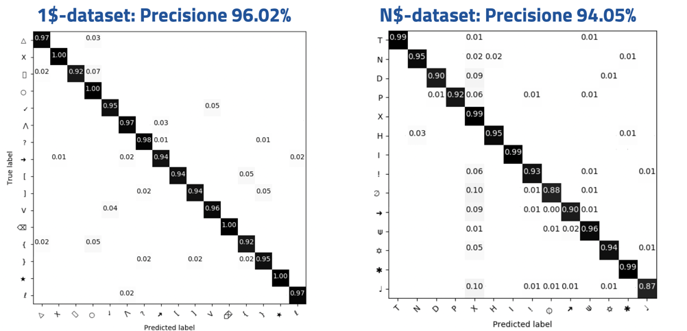
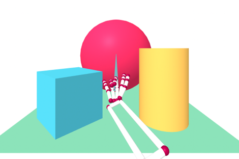
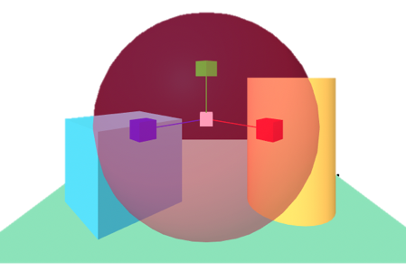
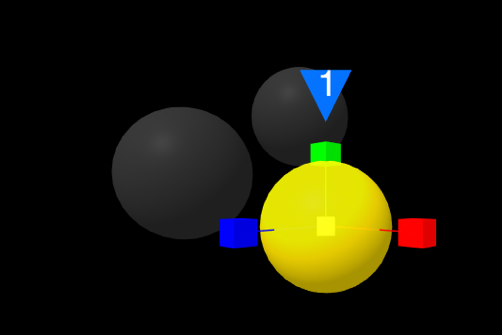
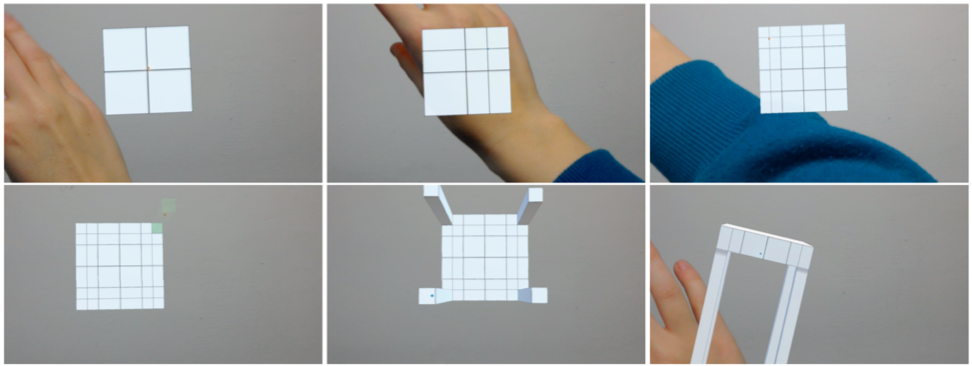
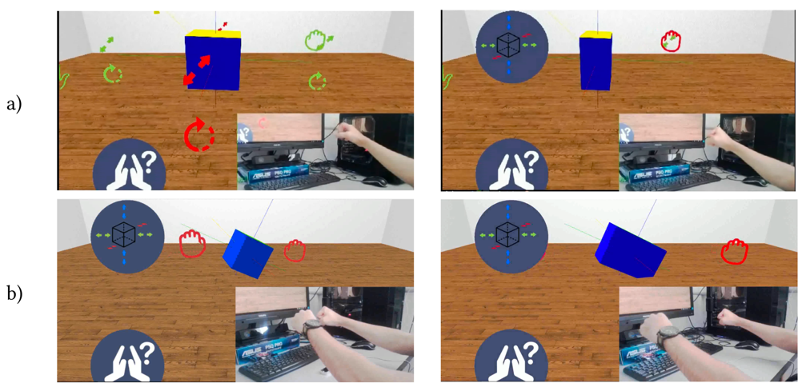

<header>
<h1>D3P2 </h1>
</header>

L’obiettivo principale del progetto D3-P2 è quello di studiare un sistema editore per contenuti digitali immersivi, 
la cui creazione e fruizione sia supportata tramite tecnologie web. Tramite questo supporto, gli utenti che non hanno 
conoscenze specifiche di 3D, di realtà virtuale (VR) o di realtà aumentata (AR) possono di creare presentazioni che 
utilizzino dispositivi di interazione avanzati, ormai alla portata del mercato di massa.

Il progetto è stato finanziato dalla [Regione Autonoma della Sardegna](https://www.regione.sardegna.it/), è iniziato nell'aprile 2017 e 
si è concluso nell'aprile 2019.

##Sommario
1. [Obiettivi](#obiettivi)
2. [Risultati](#risultati)
3. [Il gruppo di ricerca](#gruppo)
4. [Video dimostrativi](#video) 
5. [Pubblicazioni](#pubblicazioni)

## Obiettivi del progetto
L’entrata nel mercato di massa di hardware a basso costo che permette operazioni costose in passato, come 
visualizzazione di ambienti virtuali in stereoscopia, apre la strada alla fruizione di contenuti immersivi via web. 
Ma la storia del web insegna che gli utenti non vogliono solo essere dei fruitori passivi di contenuto, ma anche e 
soprattutto autori creativi. La barriera rimane però la conoscenza tecnica necessaria per manipolare le nuove tecnologie.
L’obiettivo principale del progetto D3-P2 è quello di studiare un sistema editore per contenuti digitali immersivi, 
la cui creazione e fruizione sia supportata tramite tecnologie web. Tramite questo supporto, gli utenti che non hanno 
conoscenze specifiche di 3D, di realtà virtuale (VR) o di realtà aumentata (AR) possono di creare presentazioni che 
utilizzino dispositivi di interazione avanzati, ormai alla portata del mercato di massa.

Dal punto di vista scientifico, il progetto si è proposto di risolvere due problemi di ricerca aperti:
* Fornire delle rappresentazioni degli oggetti da includere nella scena immersiva, del controllo delle loro proprietà 
statiche e interattive, che siano semplici da comprendere per l’utente ma allo stesso tempo abbastanza espressive, per 
garantire la qualità dei contenuti creati.
* Fornire un supporto dei diversi dispositivi e delle loro differenti capacità interattive, tramite l’adattamento 
delle presentazioni alla configurazione attualmente in uso dall’utente. La soluzione a questo problema è un avanzamento 
nello stato dell’arte nell’ambito della definizione di regole per interfacce adattive, che permettano di riconfigurare 
il supporto all’input dell’utente sulla base delle periferiche disponibili, nonché il rendering della scena in base alle 
potenzialità grafiche del supporto di visualizzazione. 

Gli obiettivi generali del progetto sono stati i seguenti:
1.	Creazione di contenuti immersivi tramite una combinazione di oggetti tridimensionali e contenuti multimediali, 
manipolazione e modifica degli stessi, sia in modalità di progettazione che nella modalità di fruizione dell’ambiente 
immersivo.
2.	Definizione del comportamento interattivo degli oggetti inseriti nell’ambiente, senza assumere nessuna conoscenza 
di linguaggi di programmazione da parte dell’autore.
3.	Supporto all’acquisizione ed alla esportazione di oggetti dall’ambiente virtuale a quello reale tramite 
scansione e stampa 3D
4.	Adattamento della presentazione dei contenuti e delle modalità di interazione previste creati in base ai 
dispositivi utilizzati per la fruizione.

## Risultati

###Obiettivo 1: Creazione dei contenuti immersivi
Per quanto riguarda il supporto alla creazione di contenuti immersivi, il progetto si è focalizzato nella creazione di 
diverse estensioni della libreria per sviluppatori open source [A-Frame](http://aframe.io), in modo da supportare 
l’interazione con utenti che non hanno esperienza di programmazione. 
Per quanto riguarda la modalità di progettazione, è stato volto un lavoro di categorizzazione e di 
etichettatura delle varie proprietà che descrivono le forme interattive, per adattarle al vocabolario 
utilizzato da utenti non esperti. Infine, è stato costruita un’interfaccia web che permette la modifica di 
queste proprietà, tramite interattori standard WIMP. 
La parte più innovativa nel raggiungimento di questo obiettivo, è sicuramente quella della modifica delle 
proprietà degli oggetti in modalità immersiva.  Ci siamo dapprima concentrati sulle modalità di manipolazione 
degli oggetti interattivi nell’ambiente virtuale tramite gesti. Il primo problema affrontato è stato quello della 
definizione di gesti interattivi con un linguaggio comprensibile ai designer e sviluppatori, che fornisse però un 
supporto robusto al riconoscimento. Risultato di questa ricerca è stata la definizione di DEICTIC, che permette di 
generare classificatori precisi a partire dalla descrizione del gesto sotto forma di semplici primitive geometriche 
(linee, punti o archi).  Il metodo ha dimostrato un ottimo livello di espressività e un alto tasso di riconoscimento. 
In [Figura 1](#figura1) mostriamo la matrice di confusione nel riconoscimento di due dataset molto utilizzati in letteratura, 
modellati con l’approccio studiato.
L’approccio è stato validato anche con i programmatori, dimostrandosi più semplice e rapido da utilizzare rispetto al 
tradizionale modello a eventi. 

*Figura 1: risultati del riconoscimento del dataset 1$ (5280 sequenze rappresentati 16 gesti) e del dataset 
N$ (8400 sequenze rappresentati 14 gesti) tramite la modellazione DEICTIC*

Sfruttando il supporto a gesti interattivi è stato possibile costruire l’ambiente di manipolazione dei contenuti 
interattivi in modalità immersiva, che ha la novità di essere stata realizzata sfruttando tecnologie web. 
In particolare, sono stati sviluppati e rilasciati diversi plugin per la libreria A-Frame che permettono di modificare, 
tramite gesti interattivi, le proprietà degli oggetti utilizzando il visore VR ([Codice](https://github.com/unica-tesi-hci)).
Il primo plugin permette di selezionare a distanza un oggetto nella scena, avvicinarlo all’utente per modificarlo 
(scalarlo e/o ruotarlo) e riposizionarlo alla posizione di partenza. Il gesto imita le movenze di Spider-Man per 
lanciare una ragnatela (si veda la rappresentazione del braccio virtuale in [Figura 2](#figura2)), assimilata con una metafora al 
raggio di selezione dell’oggetto. La traslazione è invece una semplice gesto di chiusura della mano per 
afferrare l’oggetto.

*Figura 2: Selezione, scalatura e rotazione dall’interno dell’ambiente virtuale*

Il secondo plugin permette invece di modificare l’illuminazione della scena, posizionando diverse luci all’interno 
dell’ambiente, controllandone la tipologia (ambiente, spot o direzionale), il colore e la luminosità ([Figura 3](#figura3)).

###Obiettivo 2: Definizione del comportamento interattivo degli oggetti
Anche per questo obiettivo si sono suddivise le funzionalità a seconda della loro complessità. Le animazioni, che sono 
comportamento interattivo più semplice da modellare e più frequente nelle scene virtuali, è supportato sia in modalità 
di progettazione che in modalità immersiva. 
La definizione delle animazioni in modalità immersiva permette la creazione di diverse pose-chiave per lo stesso oggetto. 
L’utente, oltre a aggiungere o rimuovere queste pose, può selezionare quelle esistenti e specificare, 
tramite manipolazione, il valore di diversi attributi dell’oggetto tridimensionale (posizione, scalatura, rotazione, 
colore ecc.). Durante l’esecuzione dell’animazione, il sistema interpolerà il valore degli attributi della posa di 
indice *i* verso i valori della posa *i+1*. La [Figura 4](#figura4) mostra un esempio di definizione di una animazione.

*Figura 4: definizione di una animazione in modalità immersiva. L’utente può utilizzare le maniglie per modificare 
la posa corrente. Le altre pose sono visualizzate in trasparenza*

I comportamenti definibili in modalità progettazione sono più complessi. Abbiamo utilizzato un sistema a regole la cui 
efficacia è documentata in letteratura. Si utilizzano una serie di regole del tipo Evento-Conditione-Azione, 
da mostrare tramite una rappresentazione semplificata in linguaggio naturale. Le regole hanno tutte la seguente sintassi:

~~~~
Quando <soggetto> <azione> [oggetto/quantità] 
[se condizione] 
allora <soggetto> <azione> [oggetto/quantità]
~~~~

Con la parte *quando*, l’utente stabilisce la causa per l’azione che modifica lo stato della scena. Con la parte opzionale 
*se*, si stabiliscono invece delle condizioni che devono essere verificate per intraprendere l’azione. 
La parte *allora* stabilisce quali sia l’azione o le azioni da eseguire. 

##Obiettivo 3: Acquisizione e esportazione di oggetti 3D
Abbiamo creato una libreria lato server che permette di acquisire scansioni tridimensionali di oggetti tramite Microsoft 
Kinect. Il server include delle procedure automatiche di semplificazione della geometria che permettono la 
visualizzazione del risultato su browser. Inoltre, abbiamo sviluppato uno strumento di modellazione tridimensionale 
per realtà aumentata per Microsoft Hololens, un visore non occlusivo messo a punto da Microsoft. Il modellatore permette 
di creare solo forme che rispettano i vincoli di fabbricabilità per stampanti 3D. L’interazione è basata su gesture 
riconosciute tramite Leap Motion. Il modellatore segue il paradigma box modeling, di cui integra le principali funzionalità. 
Ciascuna modifica è sottoposta ad un test di validità che previene la generazione di conformazioni non fabbricabili 
come le autointersezioni o zone prive di volume (bidimensionali). 

*Figura 5: Sequenza di modellazione di un tavolo in realtà aumentata su visore Microsoft Hololens*

###Obiettivo 4: Adattamento alla modalità di interazione
Abbiamo studiato un pattern di realizzazione di applicazioni che sfruttano la realtà virtuale sul web che permetta un 
adattamento opportunistico ai dispositivi disponibili sul sistema in uso. Questo è un problema molto importante sul web, 
dove lo stesso contenuto deve essere adattato a diverse configurazioni hardware e software. Abbiamo generalizzato la 
soluzione applicata al nostro editor di contenuti tridimensionali trasformandola in un framework che risolve diversi 
problemi noti nel campo: 1) gestione del rendering 3D della scena, 2) supporto a diversi disposivi di output 
(schermi, telefonini, visori), 3) gestione dell’orientamento dello schermo e/o del visore, 4) ricezione dell’input 
proveniente da diversi dispositivi e nodi di calcolo sul browser, 5) distribuzione dell’input e dell’output si diversi 
dispositivi, 6) utilizzo eventi astratti rispetto al dispositivo  di interazione. 
L’applicazione del framework è stata validata con uno studio utente, che ne ha dimostrato la flessibilità nel 
reimplementare in modo generico diverse metafore di interazione con gli oggetti in realtà virtuale, utilizzando 
diversi dispositivi di interazione.

*Figura 6: Esempio di adattamento dell’interazione alla metafora di interazione. Parte alta (a): scalatura di un oggetto 
utilizzando handle multipli: l’utente afferra una maglia e la muove per cambiare la dimensione dell’oggetto. 
Parte bassa (b): scalatura di un oggetto tramite la metafora handlebar. L’utente afferra una barra virtuale con 
due mani per esempio lungo l’asse X e incrementa la distanza fra le mani per incrementare la dimensione dell’oggetto*

## Il gruppo di ricerca
* **Lucio Davide Spano.** Coordinatore del progetto.
* **Fabio Sorrentino.** Assegnista di ricerca.
* **Alessandro Carcangiu.** Dottorando in Informatica.
* **Alessio Murru.** Dottorando in Informatica.
* **Matteo Serpi.** Tesista Magistrale.
* **Elisa Pau.** Tesista Magistrale.
* **Francesca Cella.** Tesista Triennale.
* **Roberta Galici.** Tesista Triennale.
* **Laura Ordile.** Tesista Triennale.
* **Riccardo Balia.** Tesista Triennale.

## Video dimostrativi

###Web5VR

<iframe width="420" height="315" src="https://www.youtube.com/embed/SE8_lN3pS4M"></iframe>

###Selezione, manipolazione e animazioni
<iframe width="420" height="315" src="https://www.youtube.com/embed/BdfmoxJNAMc"></iframe>

## Pubblicazioni supportate dal progetto
* Alessandro Carcangiu, Lucio Davide Spano, Giorgio Fumera, Fabio Roli: DEICTIC: A compositional and declarative gesture description based on hidden markov models. Int. J. Hum.-Comput. Stud. 122: 113-132 (2019)
* Alessandro Carcangiu, Lucio Davide Spano: Integrating declarative models and HMMs for online gesture recognition. IUI Companion, ACM. 2019: 87-88
* Fabio Sorrentino and Lucio Davide Spano. Post-it notes: supporting teachers in authoring vocabulary game contents. Multimed Tools Appl (2019). https://doi.org/10.1007/s11042-019-7604-6
* Fabio Marco Caputo, Pietro Prebianca, Alessandro Carcangiu, Lucio Davide Spano, Andrea Giachetti: Comparing 3D trajectories for simple mid-air gesture recognition. Computers & Graphics 73: 17-25 (2018)
* Matteo Serpi, Alessandro Carcangiu, Alessio Murru, Lucio Davide Spano: Web5VR: A Flexible Framework for Integrating Virtual Reality Input and Output Devices on the Web. PACMHCI 2: 4:1-4:19 (2018)
* Alessandro Carcangiu, Lucio Davide Spano: G-Gene: A Gene Alignment Method for Online Partial Stroke Gestures Recognition. PACMHCI 2: 13:1-13:17 (2018)
* Federico Cau, Alessandro Carcangiu, Fabio Sorrentino, Lucio Davide Spano: SnAIR Drum: A Gesture Interface for Rhythm Practice. DCPD@CHItaly 2017: 116-119
* Martina Senis, Giovanni Atzori, Fabio Sorrentino, Lucio Davide Spano, Gianni Fenu: Smart Furniture and Technologies for Supporting Distributed Learning Groups. CHItaly 2017: 11:1-11:6
* Fabio Marco Caputo, Pietro Prebianca, Alessandro Carcangiu, Lucio Davide Spano, Andrea Giachetti: A 3 Cent Recognizer: Simple and Effective Retrieval and Classification of Mid-air Gestures from Single 3D Traces. Eurographics Italian Chapter Conference 2017: 9-15
* Alessandro Carcangiu, Lucio Davide Spano, Giorgio Fumera, Fabio Roli: Gesture Modelling and Recognition by Integrating Declarative Models and Pattern Recognition Algorithms. ICIAP (1) 2017: 84-95
