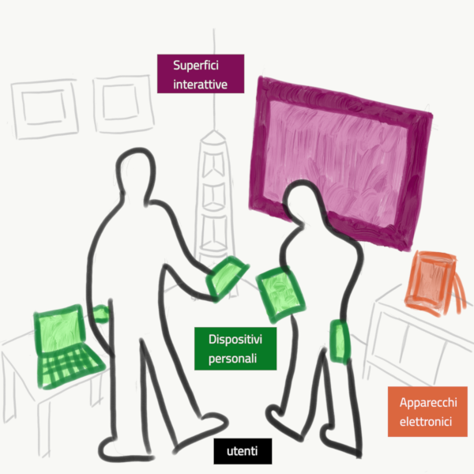
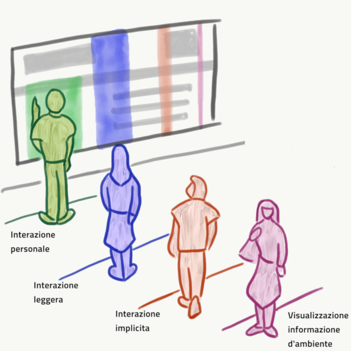
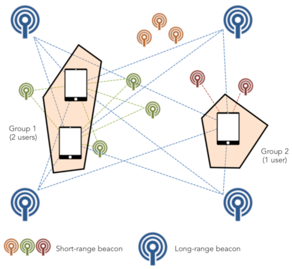

<header>
<h1>EmILIE </h1>

sEnsing ImpLicit Input and Emotions

</header>

Lo scopo del progetto è quello di coordinare un insieme di sensori di 
livello consumer, per la coordinazione di un’interazione prossemica 
con i diversi dispositivi, determinando inoltre la condizione affettiva 
dell’utente. In questo modo, le applicazioni saranno in grado di 
sfruttare in modo opportunistico i valori stimati, aumentando 
le capacità dell’hardware del dispositivo, tramite la condivisione 
delle informazioni.

Il progetto è stato finanziato dalla [Regione Autonoma della Sardegna](https://www.regione.sardegna.it/) 
e dalla [Fondazione di Sardegna](https://www.fondazionedisardegna.it/), è iniziato nell'aprile 2017 e 
si è concluso nell'aprile 2019.

##Sommario
1. [Risultati del progetto](#risultati)
2. [Il gruppo di ricerca](#gruppo) 
3. [Pubblicazioni](#pubblicazioni)

##  Risultati del progetto

Ogni giorno interagiamo con un elevato numero di dispositivi sparsi nell’ambiente 
che ci circonda o che indossiamo e portiamo sempre con noi ([Figura 1](#figura1)). 
Sebbene ognuno di loro sia collegato in modo autonomo alla rete internet, 
che consente una comunicazione con qualsiasi servizio o applicazione, 
di solito questi dispositivi supportano l’interazione con gli utenti in 
modo isolato. Ciò rende difficile la creazione di ambienti che sfruttino 
appieno l’interazione multi-dispositivo, anche in situazioni in cui sarebbero 
vantaggiose, come nei negozi, nei musei o nelle aule scolastiche.

*Figura 1: Un esempio di ambiente interattivo multidispositivo. 
Diversi utenti possono interagire con diversi dispositivi che sono 
sparsi all’interno dell’ambiente. Ogni utente può svolgere un compito con 
l’ausilio di uno o più dispositivi, 
anche collaborando con altri utenti.*

Il progetto EmILIE ha come scopo quello di studiare delle tecniche per il 
rilevamento di informazioni sulle diverse entità che compongono gli ambienti 
interattivi, coordinando e integrando i dati provenienti da diversi dispositivi.
In particolare, il progetto si è focalizzato sull’input _implicito_, cioè su 
quelle informazioni che possono essere raccolte sugli utenti e sull’ambiente 
che non sono state generate per interagire con un dispositivo in modo conscio, 
come la gestualità, la prossemica o il posizionamento all’interno dell’ambiente.  
Questo tipo di informazioni sono importanti per progettare e implementare 
interazioni usabili sui diversi livelli di interattività, riassunti in 
[Figura 2](#figura2). 

All’interno del progetto sono stati completati diversi studi pilota, 
che hanno permesso di provare la possibilità di utilizzare dispositivi 
di livello consumer come semplici camere RGB, sensori di profondità, 
microfoni, o dispositivi Bluetooth per il questo tipo di rilevamento. 

*Figura 2: Diversi livelli di interattività in base alla distanza dal dispositivo. 
Il primo livello prevede un’interazione personale con il dispositivo; 
il secondo una interazione leggera, che può essere condivisa anche fra più utenti; 
il terzo è quello dell’interazione implicita, nel quale il dispositivo può rilevare delle 
informazioni senza che l’utente le invii esplicitamente, il quarto è quello della 
visualizzazione di informazione ambientale, utile per l’analisi del 
contesto delle altre interazioni.*

I risultati del progetto si articolano su cinque linee di lavoro. 
La prima è quella della **prossemica e della localizzazione indoor**. 
All’interno del progetto è stata sviluppata un’architettura hardware e software 
per la localizzazione della posizione dell’utente all’interno di ambienti chiusi,
utilizzando come scenario d’esempio un’aula scolastica. Il sistema funziona 
tramite l’utilizzo di due tipologie di emettitori Bluetooth (beacon), una a 
lungo raggio e una a corto raggio. La prima tipologia, posizionata sulle 
pareti, permette una stima della posizione tramite triangolazione. 
La seconda permette di identificare oggetti come mobili o apparecchiature 
che non di per sé non supportano servizi digitali. 
Tramite un algoritmo di combinazione delle informazioni 
ricevute da questi emettitori su dispositivo mobile, siamo in grado di 
fornire la posizione dei diversi alunni all’interno dell’aula e di fornire 
al docente una vista sui gruppi che si formano in modo autonomo. 
Il funzionamento del sistema è riassunto in [Figura 3](#figura3). 

*Figura 3: Rilevazione della posizione di un utente all'interno di una stanza. 
I beacon a lungo raggio (long-range) permettono di stimare la posizione in modo 
assoluto tramite triangolazione. Questa informazione è integrata dal rilevamento 
dei beacon a corto raggio (short-range) che permettono di incrementare 
l’accuratezza del posizionamento. Un server centralizzato analizza 
la posizione di tutti gli utenti nell’ambiente e fornisce informazioni 
dinamiche sui gruppi che si formano spontaneamente nell’ambiente.*

Una seconda linea di lavoro è lo sviluppo e l’applicazione di 
tecniche di machine learning per il **riconoscimento delle attività dell’utente**,
sfruttando l’input implicito raccolto tramite diversi sensori. 
Durante lo svolgimento del progetto, sono state sviluppate diverse 
tecniche per risolvere problemi di base nell’utilizzo di dai dati raccolti 
in fase di analisi, come nel caso di dimensionalità elevata o nel caso di una 
distribuzione delle classi fortemente sbilanciata. Sono state studiate e 
implementate tecniche “ensamble” per il miglioramento della stabilità e 
l’efficacia del rilevamento, valutando sperimentalmente la robustezza di 
diverse tecniche di selezione degli attributi rispetto alla perturbazione 
dei dati in input. Queste tecniche, valide in generale per diverse tipologie 
di dato, sono state applicate al caso di studio del progetto per il 
riconoscimento delle attività utente. In particolare, le abbiamo 
sperimentate per la personalizzazione del riconoscimento di un insieme 
di attività in base alle caratteristiche e abilità fisiche dell’utente, 
per la personalizzazione di servizi digitali in base al contesto d’uso 
attraverso il riconoscimento di attività quotidiane (come ad esempio camminare,
correre, lavarsi ecc.) e per la personalizzazione della definizione 
dell’elenco di attività da riconoscere all’interno degli ambienti interattivi 
(p.es. una smart home) in base al feedback degli utenti, permettendo una 
semplice integrazione di nuovi sensori per il raffinamento delle attività 
riconosciute. 

La terza linea di lavoro è quella dello sviluppo di metodi e tecniche per la 
**descrizione e il riconoscimento di gesti interattivi**. 
Questa particolare forma di input permette di ottenere informazioni importanti 
nel caso di esecuzione di azioni in modo sia conscio che inconscio. All’interno 
del progetto è stata sviluppata una tecnica di modellazione basata sulla 
composizione di elementi geometrici di base (punti, linee e archi.  
Ciò permette agli sviluppatori di definire gesti interattivi come evoluzioni 
temporali di traiettorie formate da questi elementi. La tecnica ha un duplice 
vantaggio: da un lato permette al programmatore di definire i gesti con un 
linguaggio apposito, ottenendo un riconoscitore accurato che fornisce 
informazioni sia sull’intero gesto che sulle sue parti. Dall’altro lato, 
l’approccio permette all’utente di essere guidato durante l’esecuzione del 
gesto, tramite il supporto al riconoscimento parziale. Questo consente una 
maggiore usabilità dei sistemi gestuali, poiché facilitano la scoperta e 
l’esecuzione dei gesti, mitigando il problema della scelta del vocabolario 
di interazione legata alla capacità di riconoscimento dei dispositivi di 
tracciamento. 

La quarta linea di lavoro è stata l’**estrazione di conoscenza dal linguaggio 
naturale**. Abbiamo proposto un algoritmo che, a partire da un piccolo 
insieme di parole co-iperonime (come ad esempio Italia, Francia, Germania), 
restituisce una lista più lunga di elementi 
(ad es. Spagna, Portogallo, Polonia...) in maniera non supervisionata 
(cioè senza l’intervento di un umano), semplicemente interpretando 
automaticamente dei testi forniti in input. Questo consente l’estrazione 
di conoscenza strutturata su un determinato dominio o attività semplicemente 
analizzando descrizioni in linguaggio naturale. Una evoluzione di questo 
sistema permette, in modalità semi-supervisionata, a rispondere autonomamente 
a interrogazioni degli utenti in linguaggio naturale, sfruttando le conoscenze 
apprese in modo automatico. Durante la sperimentazione, l’approccio 
è stato applicato agli open data sulle spese dei governi di diversi Paesi, 
ottenendo dei risultati incoraggianti. Una tecnica simile è stata 
inoltre applicata alla documentazione e al codice di librerie software 
(in linguaggio Java), creando una ontologia (CodeOntology) interrogabile 
per vari scopi come l’ingegneria del software o il question answering 
computazionale. 

La quinta linea di lavoro comprende le tecniche per la **dimostrazione di 
proprietà** sui dati raccolti, in modo da rendere più semplice, 
efficace e sicuro il salvataggio e l’analisi dei dati. I risultati 
in questa linea hanno portato allo sviluppo di tecniche per individuare 
analogie tra le varie informazioni, in modo da eliminare inutili duplicazioni. 
Questo ha consentito di comprendere come differenti alternative nelle 
varie evoluzioni possano essere compattate, introducendo il concetto di 
merging relation che per ora ha trovato applicazione nell’ambito delle Reti 
di Petri. Infine, ci si è concentrati nella definizione di modelli per la 
dimostrazione di proprietà formali relative alla correttezza e completezza 
di contratti per l’utilizzo di dati e l’esecuzione dei servizi, che consente 
di offrire garanzie dimostrabili agli utenti dei servizi stessi. 

##  Il gruppo di ricerca
Il progetto è stato realizzato all'interno del [Dipartimento di Matematica e Informatica](https://dmi.unica.it/).
Il gruppo di ricerca è formato dai seguenti professori:
* **Lucio Davide Spano.** Interazione Uomo Macchina. Coordinatore del progetto.
* **Barbara Pes.** Data Mining. Estrazione della conoscenza. 
* **Daniele Riboni.** Pervasive Computing. Prossemica e riconoscimento delle attività.
* **Riccardo Scateni.** Computer Grafica. Geometria Computazionale. 
* **Giovanni Puglisi.** Computer Vision. Elaborazione video e immagini. 
* **Diego Reforgiato.** Sentiment Analysis. Riconoscimento emozioni. 
* **Maurizio Atzori.** Web Semantico. Rappresentazione della conoscenza e analisi linguaggio naturale.
* **Massimo Bartoletti.** Sicurezza. Sicurezza nello scambio di informazioni. 
* **Michele Pinna.** Metodi Formali. Computazioni distribuite.  

##  Pubblicazioni supportate dal progetto
### 2019
* 	Alessandro Carcangiu, Lucio Davide Spano, Giorgio Fumera, Fabio Roli.
_DEICTIC: A compositional and declarative gesture description based on hidden markov models._ 
Int. J. Hum.-Comput. Stud. 122: 113-132 (2019).
* Alessandro Carcangiu, Lucio Davide Spano:
  _Integrating declarative models and HMMs for online gesture recognition._ 
  IUI Companion 2019: 87-88
* M. Bartoletti, B. Bellomy, L. Pompianu. A journey into Bitcoin metadata. 
In Journal of Grid Computing, 2019. 
[Paper](http://tcs.unica.it/journey-bitcoin-metadata.pdf?attredirects=0)
* M. Bartoletti, R. Zunino. Verifying liquidity of Bitcoin contracts. In 
  Proc. POST, 2019. [Paper](https://eprint.iacr.org/2018/1125)
* Roberto Cocco, Maurizio Atzori, Carlo Zaniolo. _Machine Learning of SPARQL Templates for 
Question Answering over LinkedSpending._ 28th IEEE International 
Conference on Enabling Technologies: Infrastructure for 
Collaborative Enterprises (IEEE WETICE 2019), DEW Track (DEW 2019) (2019)
* Barbara Pes. _Handling class imbalance in high-dimensional biomedical datasets._ 
28th IEEE International Conference on Enabling Technologies: 
Infrastructure for Collaborative Enterprises (WETICE 2019), June 12-14, 2019,
Capri (Napoli), Italy, to appear.
* Barbara Pes. _Ensemble feature selection for high-dimensional data: a 
stability analysis across multiple domains._ Neural Computing and 
Applications, 2019.
  [10.1007/s00521-019-04082-3](https://doi.org/10.1007/s00521-019-04082-3).
* Assunta Matassa, Daniele Riboni. _Reasoning with Smart Objects’ 
  Affordance for Personalized Behavior Monitoring in Pervasive Information 
  Systems._ Knowledge and Information Systems, Springer, 2019. To appear.
* Daniele Riboni, _Opportunistic Pervasive Computing: Adaptive Context 
Recognition and Interfaces._ 
CCF Transactions on Pervasive Computing and Interaction, Springer, 2019. 
[10.1007/s42486-018-00004-9](https://doi.org/10.1007/s42486-018-00004-9).

### 2018
* 	Fabio Marco Caputo, Pietro Prebianca, Alessandro Carcangiu, 
Lucio Davide Spano, Andrea Giachetti:
_Comparing 3D trajectories for simple mid-air gesture recognition._ 
Computers & Graphics 73: 17-25 (2018)
* 	Matteo Serpi, Alessandro Carcangiu, Alessio Murru, Lucio Davide Spano:
  _Web5VR: A Flexible Framework for Integrating Virtual Reality Input and 
  Output Devices on the Web._ PACMHCI 2: 4:1-4:19 (2018)
* 	Alessandro Carcangiu, Lucio Davide Spano:
  _G-Gene: A Gene Alignment Method for Online Partial Stroke Gestures Recognition._
  PACMHCI 2: 13:1-13:17 (2018)
* M. Bartoletti, B. Pes, S. Serusi. Data mining for detecting Bitcoin 
  Ponzi schemes. In Proc. Crypto Valley Conference on Blockchain 
  Technology, 2018
  [Paper](https://arxiv.org/abs/1803.00646)
* M. Bartoletti, T. Cimoli, L. Pompianu, S. Serusi. Blockchain for social 
  good: a quantitative analysis. Presented at Goodtechs, 2018
  [Paper](https://arxiv.org/abs/1811.03424)
* M. Bartoletti, T. Cimoli, R. Zunino. Fun with Bitcoin smart contracts. 
  In Proc. ISOLA, 2018.
  [Paper](https://eprint.iacr.org/2018/398.pdf)
* M. Bartoletti, L. Bocchi, M. Murgia. Progress-preserving Refinements of 
CTA. In Proc. CONCUR, 2018
[Paper](https://www.cs.kent.ac.uk/people/staff/lb514/catr.html)
* M. Bartoletti, R. Zunino. BitML: a calculus for Bitcoin smart contracts. 
  In Proc. ACM CCS, 2018. Also available as Cryptology ePrint Archive 
  2018/122, 2018
  [Paper](https://eprint.iacr.org/2018/122.pdf)
* N. Atzei, M. Bartoletti, S. Lande, R. Zunino. A formal model of Bitcoin 
  transactions. In Proc. Financial Cryptography, 2018
  [Paper](https://eprint.iacr.org/2017/1124.pdf)
* N. Atzei, M. Bartoletti, T. Cimoli, S. Lande, R. Zunino. SoK: unraveling 
  Bitcoin smart contracts. In Proc. POST, 2018. 
  [Paper](https://eprint.iacr.org/2018/192.pdf)
* Gabriele Civitarese, Claudio Bettini, Timo Sztyler, Daniele Riboni, 
  Heiner Stuckenschmidt, _NECTAR: Knowledge-based Collaborative Active 
  Learning for Activity Recognition._ In Proceedings of the 2018 IEEE 
  International Conference on Pervasive Computing and Communications 
  (PerCom), IEEE Computer Society, 2018.
* Barbara Pes. _Evaluating Feature Selection Robustness on High-Dimensional
 Data._ 13th International Conference on Hybrid Artificial Intelligence 
 Systems (HAIS 2018), Oviedo, Spain, June 20-22, 2018, LNCS, vol 10870, 
 pp 235-247, Springer.
 [10.1007/978-3-319-92639-1_20](https://doi.org/10.1007/978-3-319-92639-1_20).
* Carlo Zaniolo, Shi Gao, Maurizio Atzori, Muhao Chen, Jiaqi Gu. 
 _User-Friendly Temporal Queries on Historical Knowledge Bases_
  Information and Computation, Time 2015 special issue, Elsevier (2018)
* Maurizio Atzori, Simone Balloccu and Andrea Bellanti. _Unsupervised Singleton 
Expansion from Free Text._
ICSC 2018 - 10th IEEE International Conference on Semantic Computing (2018)

### 2017
* 	Martina Senis, Giovanni Atzori, Fabio Sorrentino, Lucio Davide Spano, Gianni Fenu:
  _Smart Furniture and Technologies for Supporting Distributed Learning Groups._ 
  CHItaly 2017: 11:1-11:6
* Fabio Sorrentino, Lucio Davide Spano, Sara Casti, Alessandro Carcangiu, 
Fabrizio Corda, Gianmarco Cherchi, Alessio Murru, Alessandro Muntoni, Stefano Nuvoli, 
Riccardo Scateni:
_ChIP: Teaching Coding in Primary Schools._ DCPD@CHItaly 2017: 106-110
* Giovanni Casu, G. Michele Pinna, _Merging Relations: A
  Way to Compact Petri Nets’ Behaviors Uniformly_, in Proceeding of LATA
  2017, Lecture Notes in Computer Science 10168, pp. 325–337, 2017.
* 	Fabio Marco Caputo, Pietro Prebianca, Alessandro Carcangiu, Lucio Davide Spano, Andrea Giachetti:
  _A 3 Cent Recognizer: Simple and Effective Retrieval and Classification of Mid-air Gestures from Single 3D Traces._ 
  Eurographics Italian Chapter Conference 2017: 9-15
* N. Atzei, M. Bartoletti, T. Cimoli. A survey of attacks on Ethereum 
  smart contracts (SoK). In Proc. POST, 2017
  [Paper](https://eprint.iacr.org/2016/1007)
* M. Bartoletti, A. Bracciali, S. Lande, L. Pompianu. A general framework 
  for blockchain analytics. In Proc. SERIAL, 2017
  [Paper](https://dl.acm.org/citation.cfm?id=3152831)
* Mattia Atzeni, Maurizio Atzori. _CodeOntology: RDF-ization of Source Code._  
ISWC 2017 - Proceedings of the 16th International Semantic Web Conference, 
Resource Track (2017)
* Atzeni Mattia, Maurizio Atzori. _CodeOntology: Querying Source Code in 
a Semantic Framework._ ISWC 2017 - Proceedings of the 16th International 
Semantic Web Conference, Demo Paper (2017)
* Maurizio Atzori, Ludovico Boratto, Lucio Davide Spano. _Towards Chatbots 
as Recommendation Interfaces._ 2nd Workshop on Engineering Computer-Human 
Interaction in Recommender Systems (EnCHIReS 2017) part of 9th ACM 
SIGCHI Symposium on Engineering Interactive Computing Systems (EICS 2017), 
26-29 June, 2017 Lisbon, Portugal (2017)
